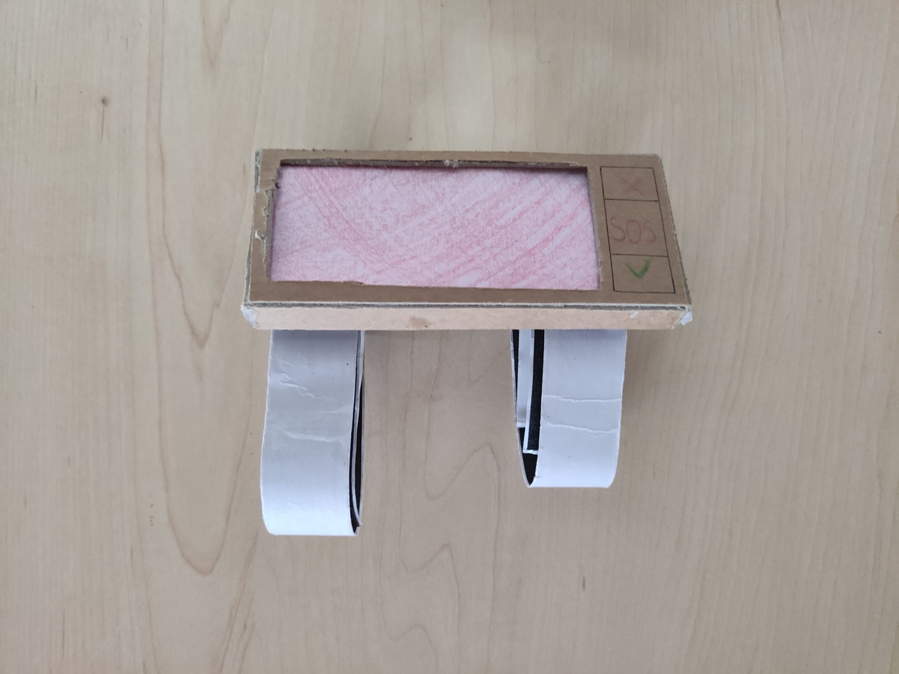
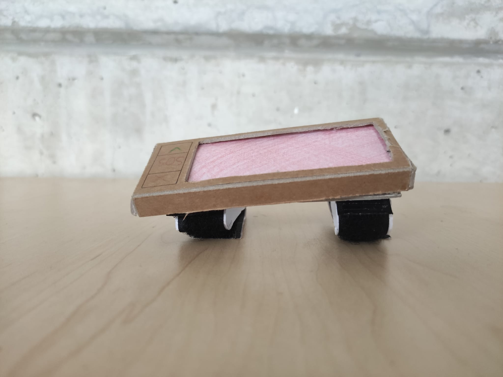
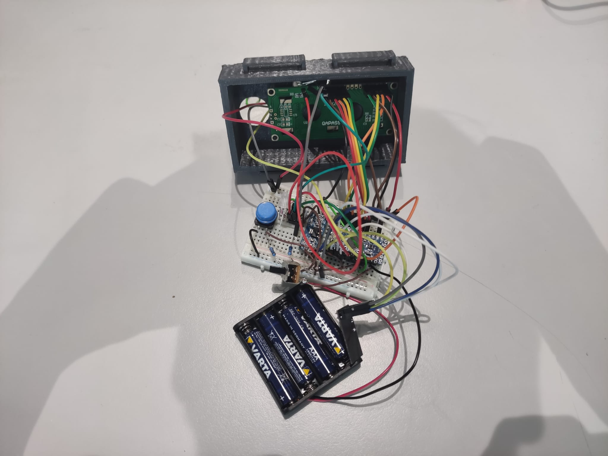
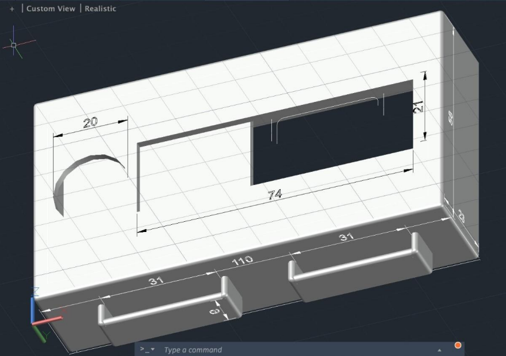

# AlertMe
The code in this repository is meant for a physical product that was completely designed by students. The main components that the product uses are: 
* 2 Arduino Pro Mini 5V boards
* 2 NRF24L01+ Wireless Modules
* 1 Vibration DC Motor Module - 3.7-5.3V - Small
* 1 LCD Display
* 3 RGB LED - 5mm Diffuse
 

# Usage
To run the code, you need to add the Custom Libraries to your Arduino library folder and install one additional external library, which can be found here: https://github.com/nRF24/RF24

# Prototype Images
 

 
